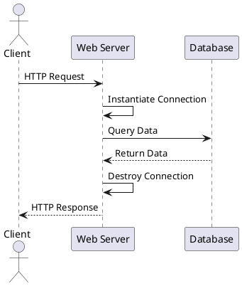
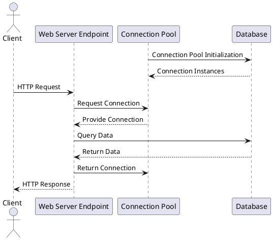
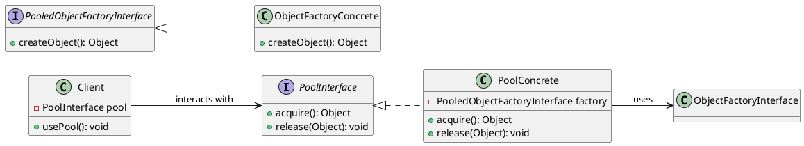
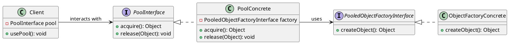

---
export_on_save:
  html: true
---

# Object Pool (Padrão Criacional)

## Intenção

Gerenciar a criação, armazenamento, emprestimo, retomada e reutilização de instancias de objeto, com o objetivo de controlar a quantidade de instancias existentes ou previnir o processo de criação e destruição recorentes quando estes forem considerados caros.

## Também conhecido como

Pool de recursos

## Motivação

Para se comunicar com um banco de dados, é necessario estabelecer uma "conexão" com ele:

```java
Connection connection = DriverManager.getConnection(
                "jdbc:mysql://localhost:3306/meu_banco",
                "usuario",
                "senha" )

Statement statement = connection.createStatement();

ResultSet resultSet = statement.executeQuery("SELECT id, nome FROM clientes");
```

Em uma aplicação como um sistema web, onde varias requisições chegam o tempo todo, e para cada requisição é comum termos que acessar o banco de dados uma ou mais vezes, nesse caso, para cada acesso precisariamos instanciar a conexão.




Isso rapidamente apresenta um problema, estabelecer uma conexão com banco de dados é um processo relativamente caro e demorado, é necessario a realização de diversas etapas tanto no servidor de banco quanto no cliente que está se conectando. Além disso, servidores de banco de dados possuem um numero maximo de conexões simultaneas que ele pode manter.

Em um cenario em que por exemplo uma aplicação receba 1000 requisições/s, e para cada requisição sejam necessarias em media 2 consultas ao banco de dados, isso significa que estariamos instanciando e destruindo 2000 conexões por segundo, um numero que facilmente extrapolaria o limite de conexões de um banco de dados.

Em vez disso, usando o pattern de object pool, podemos implementar uma classe que sirva como pool de conexões, dessa forma, ao precisarmos de uma conexão solicitamos ao pool, que ira nos fornecer uma conexão já existente que foi inicializada com o pool. Ao terminamos de usar a conexão, devolvemos ela ao pool.

<figure>



</figure>


## Aplicabilidade

Use object pool quando:

- For **demorado** criar uma instancia
- For **caro** em recursos criar uma instancia
- For **demorado** destruir uma instancia
- For **caro** em recursos destruir uma instancia

- Existe um **limite** de quantas instancias possam existir simultaneamente

Com **recursos**, queremos dizer por exemplo cpu, ram, disco e rede por exemplo

Não use object pool quando:

- O **custo** de **manter** a instancia, mesmo quando não está sendo usada, supera o custo de instanciala.

## Estrutura





## Participantes

- **PoolInterface**
    - Define uma interface comum para todas as implementações de classes de pool de objetos
- **ObjectFactoryInterface** 
    - Define uma interface comum para todas as implementações de classes fabricas de objetos que seram guardadas em pool.
- **Client**
   - Aquele que necessita das instancias do objeto que sera guardado em pool.

## Implementação

- Implementação de um pool

@import "objectpool/src/main/java/com/example/implementations/simple/SimplePool.java"


## Exemplo de código

- Uso de um pool


```java
PoolInterface<CheapObject> pool = new SimplePool<CheapObject>(1, new CheapObjectFactory());

        for (int i = 0; i < 100; i++) {
            CheapObject cheapObject = pool.acquire();
            cheapObject.doSomething();
            pool.release(cheapObject);
        }
```

## Usos conhecidos

- Conexões com bancos de dados geralmente são gerenciados por um object pool

- Servidores web e de aplicação implementam um pool de threads para o processamento de requisições

- Em aplicações multithreads, threads de trabalho são gerenciadas por um object pool

## Padrão relacionados

## Outro exemplo

Metáfora: Processador Multinúcleo como um Pool de Objetos

O processador multinúcleo pode ser comparado ao Padrão de Pool de Objetos, onde cada núcleo representa um recurso reutilizável que executa tarefas e depois retorna ao pool para ser reutilizado.

### Participantes 

ObjectPool (Gerenciador de Núcleos) – Gerencia a alocação e liberação de núcleos do processador.

Recurso (Núcleo do Processador) – Cada núcleo é um recurso que pode ser usado para executar tarefas.

Cliente (Sistema Operacional) – O sistema operacional solicita núcleos para processar tarefas e os devolve ao pool quando terminam.

### Plano UML (Diagrama)



### Cenário

Suponha que um processador quad-core (4 núcleos) precisa processar múltiplas tarefas enviadas pelo sistema operacional. Em vez de criar e destruir núcleos repetidamente (o que seria inviável), o sistema operacional usa um Pool de Objetos, onde cada núcleo pode ser reutilizado para diferentes tarefas.

O sistema operacional recebe 8 tarefas para processar.

Ele solicita núcleos ao ObjectPool.

O ObjectPool fornece os 4 núcleos disponíveis.

Os núcleos processam as 4 primeiras tarefas.

Quando uma tarefa termina, o núcleo retorna ao pool e recebe uma nova tarefa.

Esse ciclo continua até que todas as 8 tarefas sejam concluídas.

### Exemplo em Java

```java
import java.util.concurrent.BlockingQueue;
import java.util.concurrent.LinkedBlockingQueue;

// Classe que representa um núcleo do processador
class Nucleo {
    private final int id;

    public Nucleo(int id) {
        this.id = id;
    }

    public void processarTarefa(String tarefa) {
        System.out.println("Núcleo " + id + " processando: " + tarefa);
        try {
            Thread.sleep(1000); // Simula o tempo de processamento
        } catch (InterruptedException e) {
            e.printStackTrace();
        }
        System.out.println("Núcleo " + id + " concluiu: " + tarefa);
    }
}

// Classe que gerencia o pool de núcleos
class PoolNucleos {
    private final BlockingQueue<Nucleo> pool;

    public PoolNucleos(int quantidadeNucleos) {
        pool = new LinkedBlockingQueue<>();
        for (int i = 1; i <= quantidadeNucleos; i++) {
            pool.offer(new Nucleo(i)); // Adiciona núcleos ao pool
        }
    }

    public Nucleo obterNucleo() throws InterruptedException {
        return pool.take(); // Obtém um núcleo disponível
    }

    public void liberarNucleo(Nucleo nucleo) {
        pool.offer(nucleo); // Retorna o núcleo ao pool
    }
}

// Simulação do sistema operacional enviando tarefas para os núcleos
public class ProcessadorMultinucleo {
    public static void main(String[] args) {
        PoolNucleos pool = new PoolNucleos(4); // Criando um processador quad-core
        String[] tarefas = {"Tarefa A", "Tarefa B", "Tarefa C", "Tarefa D", "Tarefa E", "Tarefa F"};

        for (String tarefa : tarefas) {
            new Thread(() -> {
                try {
                    Nucleo nucleo = pool.obterNucleo();
                    nucleo.processarTarefa(tarefa);
                    pool.liberarNucleo(nucleo);
                } catch (InterruptedException e) {
                    e.printStackTrace();
                }
            }).start();
        }
    }
}
```
### Descrição

Esse código simula um processador quad-core que recebe várias tarefas. O Pool de Objetos (classe PoolNucleos) gerencia os núcleos e evita a criação desnecessária de novos recursos, garantindo que os núcleos sejam reutilizados.

O sistema operacional solicita núcleos.

Cada núcleo processa uma tarefa e retorna ao pool.

O processo continua até que todas as tarefas sejam concluídas.

Isso melhora a eficiência e evita desperdício de recursos, assim como um processador multinúcleo faz na vida real.

### Conclusão

O processador multinúcleo se encaixa perfeitamente no Padrão de Pool de Objetos, pois gerencia múltiplos núcleos de forma eficiente, reutilizando recursos em vez de criar novos, exatamente como o pool faz com os objetos.

## Referências

